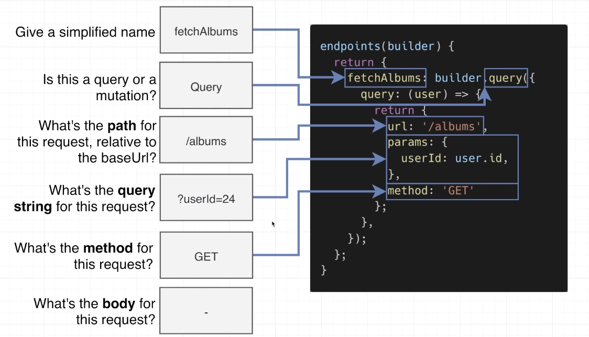
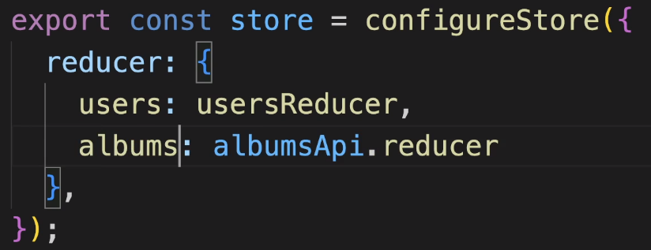
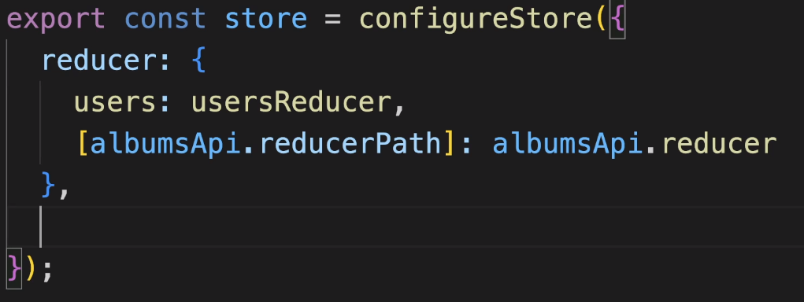

# About Project
    # We will be fetching random list of users (from faker library) and store them in the database
    # Under every user we will have a random list of albums
    # Under every album we will have a random list of photos
    # To these lists we can add/delete datas
Note: Each album is tied to a particular user and each photo is tied to a particular album. We have to provide that relationship. More on this in next section (Relationship between users, albums and photos).
    # You remember the books project database where we will display the books title and the image that is being stored in the database will be fetched during the initial application loading?
    # We are not going to do that. Rather we will just fetch the list of users during the initial load.
        # Then When a particular user is clicked, we will fetch the albums
        # Then when a particular album is clicked, we will fecth the photos
    # This is called as lazy fetching. This will reduce the initial load on the client's end.

# Relationship between users, albums and photos
There are 2 ways to achive this - Denormalized form and Normalized form
    # Denormalized form: This is what we are generally accustomed so far in this course. Under user we will have albums and under albums we will have photos.
    # Normalized form: This is similar to SQLite that we have learned from edx course. List of users, albums and photos - all of them will be separate arrays. Now one poroperty of a list will be tied to another. (like id of one list with userid of another list)

# json-server
    # It is a tool primarily used to provide a full fake REST API with zero coding in less than 30 seconds. 
    # It’s often used for front-end development for prototyping and mocking123

# Options for Data-fetching in Redux Tookit
  1. Async Thunk functions - slightly older and more complicated
  2. Redux Tookit query - newer and fancier way
We will make use of the both (1. users, 2. albums and photos) to understand how they work

# Understanding Data-fetching
Reducers are 100% synchronous. Its only job is to recognise the change in state and update them.
Hence we should never make requests from reducers.

# Lets go through step by step
1. Initial request (fetchUsers): When the page loads, initial user list should be fetched. During the fetching process we will show loading screen. If fetching is successful, data will be shown. If fetching failed, we will display 'Error fetching the data'.
        # data: array
        # isLoading: bool
        # error: null/error object  
Now whenever the page loads, we have to dispatch 2 actions. One for success and another for failure. We need to have 3 states. One for initial loading of application where isLoading value will change and two for success and failure.
    # Understanding Async thunk:    
        # It automatically dispatches actions when the request is made. (Look how far we have come. Initially we have to manually write actions with useReducer. With redux, we just need to dispatch. Now with async thunk, even dispatching is taken care of)
            # When the request is made, this automatic action will have a type called 'pending'. We can use 'pending' to say that "if the type is pending, then change the state of "isLoading: true"
            # When it successfully fetches the data, it will dispatch another action with type called 'fulfilled'. Based on this we can say that the state changes and will update "isLoading:false". We will also udpate the data with new values.
            # If failed, exactly same process where isLoading will be true. Here the dispatched action with type is called 'rejected' But data will be not changed (since no data is received). Hence data will still have the old value. But error will be updated from null to error object.
    # Creating an async thunk:
        1. Create a new file for the thunk. Name it after the purpose of the request.
        2. Create a thunk. Create a base type that describes the purpose of the request.
        3. In the thunk, make the request, return the data that you want to use in the reducer.
        4. In the slice, add extraReducers, wathcing for action type made by the thunk.
        5. Export the thunk from the store/index.js file 
    # Understanding Syntax:
        # First argument is a string that serves as a prefix for the action types created by the thunk. It is usually written in the format of 'slice/action'. In our code, the action types will be named as following.
            1. 'users/fetch/pending'
            2. 'users/fetch/fulfilled'
            3. 'users/fetch/rejected'
        # Second argument is an async()
    # Return value of the request: createAsyncThunk() returns a special action creator function called 'thunk' that, when called, will dispatch a series of actions representing the different stages of an asynchronous operation (initial request => pending, successful request => fulfilled and failed request => rejected). Just keep in mind that just like any other action object, thunk function should also be dispatched. 
        # We know that an action object has two properties. One is type and other is the payload. However, when using createAsyncThunk from @reduxjs/toolkit for handling async operations, the generated actions can have additional properties, including error and meta. This is to handle the three states of an asynchronous operation: pending, fulfilled, and rejected. So when the operation is rejected, we will have an error and that error is assigned to the error property of the state which can be displayed to the user.
        # 'response.data' will return the data if the request is fulfilled or will return an error if the request is rejected. This result will be automatically assigned to the payload property of createAsyncThunk() if successful or will be assigned to the error property of createAsyncThunk() if the request is failed. 
        # On the other hand, the first argument of createAsyncThunk() will be assigned to the type property by preceding with the slice name.
            1. fetchUsers.pending is equivalent to 'users/fetch/pending'
            2. fetchUsers.fulfilled is equivalent to 'users/fetch/fulfilled'
            3. fetchUsers.rejected is equivalent to 'users/fetch/rejected'
2. usersSlice: 
        # Now under usersSlice we need to declare extraReducers to listen to these actions. Why extraReducers?    
            # Because these action types are not typically related to adding/deleting users. Rather they are just related to  initial fetching of users.
            # Hope you remmber that first argument of addCase property of builder object is the variable name that holds the action object which we create (Redux creates actions only for reducer functions. Not for extraReducers). But here, async thunk creates the action for us. It can be represented as just a string as (users/fetch/pending,fulfilled,rejected) or (variableName.pending,fulfilled,rejected). We will go with second method which can be only used with AsyncThunk. 
3. usersList:
        # This is where we will dispatch the Async thunk. Dispatch will happen under useEffect() as it is an onetime event.
        # With useSelector() we will return the updated state and also deconstruct updated properties  like data, isLoading and error. We will use this to customise what the use should be seeing for during loading, error and display of data.
            # For loading, we are using 'Skeleton.jsx' to add customisation
4. Adding/Removing users:
        # Whenever 'add user' is clicked, we need to make a POST request to json-server and get the fake data using faker library.
        # So again we will start with 'createAsyncThunk()'
            # users/add/pending
            # users/add/fulfilled
The same applies for removing users too.  
5. Add new reducers under extraReducers(usersSlice) with actions => addUser.pending,fulfilled,rejected and also for removeUser => removeUser.pending,fulfilled,rejected
6. Export the thunks from index.jsx for addUser (You should have already done it for fetchUsers too)
7. Big Decision:
We have an issue here. Whenever we add an user, we see the skeleton element during loading. Why? Because whether you make an initial request to fetch all the users or you make a reuqest to add a new user, it will start with a pending state which will set 'isLoading:true'. But this is not ideal. Imagine the user experience when they are having a poor connection or the server side throttling for some reason. Or even with a good connection we want to show animation only with respect to the button (addUser) that has been clicked. We can disable the button (so that user will not click again and again making new requests) and show loading animation (like a spinning wheel) while rest of the page is not affected. How can we do that? Lets look at some of the possible solutions
    (a) Obvious but not an ideal solution: 
        # Adding another bool to the usersSlice state. 'isCreatingUser: true'. So whenever a user is added, isCreatingUser will be true. But there are shortcomings to this.
        # We also want to delete users. Lets say that delete button is not a single button, rather it is associated with each user. When you click on that we want to show animation (again a spinning wheel) in the same place where the delete button was placed to let the user know that deletion process is underway. To achieve we might add another boolean called 'deletingUser'. But this will not work. Because we will not be able to communicate which user to be deleted. Hence we will not be able to decide near which user we should be showing the delete button and near which user we should be showing loading animation. We can achieve that by making deletingUser as an array of objects with properties => id's and users. But there are better ways than this. Still we should know this can be achieved.
    (b) Fine grained loading state:
        # Option 1:
            # This is basically going back to the beginning. Maintaining separate state variable for each kind of request. But wait a minute..... We are using a redux here for god sake. The concept of redux itself is the centralised state management. Then how can we separate component state for these? The truth is we can. Surpise surprise. 
            # In real world projects we may/may not refrain depending up on the project. So it is good know that both redux and component state management can exist in a single project. 
            # Here, rather than adding many boolean values to the usersSlice, we create a new component for each state(just like we did during when we learned useState hook)
            # IMPORTANT To NOTE: We will be undoing certain steps that we did above. Like loading and pending state will be deleted from the usersSlice. They will be created as new separate components (isLoadingUsers, isCreatingUsers, loadingUsersError, creatingUserError, isDeletingUser, deletingUserError, doFetchUser and doCreateUser). So now the userSlice will just have data state.
        # Option 2: This makes use of RTK query. The explanation below is just for understanding purpose. RTK does something similar in the background. When we use RTK query we are really not going to all of the below details. (only some of them). Also this entire code will be rewritten without async thunk. Lets classify the options we have for clarity. Either we use async thunk with individula component states where both centralised state and individual component state exists together or we use RTK query which an another feature with in redux. Hence state management remains centralised.  
            # In standard Redux, dispatch() returns the action object that was dispatched. But dispatch under async thunk, it will return a promise (because async always returns a promise). When we look at the return value in console we will see a property called 'requestId'. 
            # Note:
                # In Vuex (a state management library for Vue.js), dispatch() also returns a Promise. This allows you to chain dispatches to ensure a specific order of operations.
                # So, whether dispatch() returns a Promise or not depends on the specific state management library and middleware (async think in this case) we are using. 
            # Promise:
                # A Promise is an object that represents the eventual completion (or failure) of an async operation and its resulting value. 
                # A Promise can be in one of three states:
                    1. Pending: The initial state, neither fulfilled nor rejected.
                    2. Fulfilled: The operation completed successfully.
                    3. Rejected: The operation failed.
                # Promise takes one argument, a callback function, which itself takes two arguments: resolve and reject. Based on whether the promise is resolved/rejected we perform certain tasks.
                # So generally we chain .then and .catch with promise to handle resolve and rejection.
                # MISUNDERSTANDING (missed to understand): We learnt in the past that when a promise is resolved, .then will be executed and when a promise is rejected, .catch will be executed. But there is minor issue or missing part in this.
                    # We never saw an example where .then taking two arguments. Actually .then can take 2 arguments and .catch can take 1 argument. 
                    # When a Promise is created, it is initially in the 'pending' state.
                        # If it is fulfilled, first argument of .then will be executed
                        # If it is rejected, second argument of .then will be executed
                    # The obvious question is why provide a rejection handler in .then() when you can catch rejections with .catch()? 
                        # It allows you to handle fulfillment and rejection in one place. 
                        # It allows you to handle rejections differently for different parts of your Promise chain.
                        # But these two can achieved with our previous knowledge of .then and .catch too. But we were not aware of teh second argument of .then
            # Now under redux store we can create a new slice called request and manage all of the different requests. 'requests' can be array of objects with properties such as id: requestId, status: pending/rejected/fulfilled and error: error.
                # Unlike option 1, here we are not using state components. Rather state is managed under redux store itself.
        # So among option 1 and option 2, option 2 is the one we will be making use of for most of the time with redux toolkit query. But if we don't/cannot use RTK (depeninding up on project and senior engineer who generally decideds these), we should know how option 1 works.
            # We will be implementing both 1 and 2. With 1, we will write code for fetching initial users, adding/deleting users, loading animation during initial-fetch/adding/deleting and error message during initial-fetch/adding/deleting.
            # With 2, we will be implementing adding adding/deleting albums and photos for each user 
8. Updating usersList with respect to option 1:
        # We are breaking this file into two for better readability (userList and usersListItem). usersList will have, for fetching initial users => doFetchUsers, isLoadingUsers, loadingUsersError; for adding a user => doCreateUser, isCreatingUser, creatingUserError. usersListItem will have, for deleting a user => doRemoveUser, isLoading, error.
        # When you look at their functions, they have lot of commonality. So best opportnuity to create a custom hook. (use-thunk)
        # At this point, all the state updates reagrding a user except data will be updated with use-thunk.
9. Updating userListItems: 
        # Now we will restructure the component as header and children and pass them as props to ExpandablePanel component where header will be the userListItems and children will be the newly created AlbumsList. AlbumList will receive 'user' as the prop.
        # Now AlbumList component will return the list of albums

Note: From now on we will be making use RTK query (option 2)

# Flow of the project:
    # Initial loading of the app is handled by fetchUsers; add functionality is handled by UsersList; delete functionality is handled by usersListItem. 
    # The click event handler for add/delete and dofetch users within useEffect (both of which has the access to custom thunk) will run the thunk function in the custom-thunk.
    # Custom-thunk function is where the dispatch happens. We are dispatching the fetchUsers/addUser/removeUser function which are defined as separate components.
        # It is from these components, the post request is made to the JSON server. 
    # Now based on the state of request (pending/rejected/fulfilled), states are updated in usersSlice component.             

10. RTK Query API
        # Here an API doesn’t refer to a backend server, but rather to a set of “endpoints” that describe how to retrieve data from backend APIs and other async sources. 
        # RTK Query allows you to define a service using a base URL and expected endpoints. Each endpoint can be a query operation that can be performed with any data fetching library of your choice. 
        # Example: You might define a query endpoint that constructs a URL (including any URL query params), or a queryFn callback that may do arbitrary async logic and return a result. 
        # This approach simplifies common cases for loading data in a web application, eliminating the need to hand-write data fetching & caching logic yourself.

11. Steps in creating a RTK Query API
    1. Identify the requests and group them together: UsersAPI (Fetch users, Create a user, delete a user), AlbumsAPI (Fetch albums, create an album, delete an album) and PhotosAPI (Fetch photos, create a photo and delete a photo)
        Note: We have already done with UsersAPI using AsyncThunk
    2. Make a new file that will contain the new API store/API's. There are 3 properties that we add in when we create an API. They are reducerPath, baseQuery and endPoints. createApi it automatically creates a slice to store a ton of state related to data, request status, errors, etc. To manage all we will be creating something called as 'reducerPath'. The only job of reducer path is to specify the place of where the state's to stored inside the redux store. Like it provides the key in the redux store. That is all it does. We speciy the name of the slice in the redux store right? Exactly that. Convention is to name the reducerPath as the name of the api itself.     
    3. API needs to know how and where to send requests. To manage this we have property called 'baseQuery' with a property value called fetchBaseQuery(). This function will give us some preconfigured version of fetch () we have to import it by the way. To this we need to pass our configuration (we have passed baseUrl alone). Preconfigured version of fetch is as follows.
            # baseURL (string): The base URL for your API. This is the URL that will be prepended to all relative endpoint paths.
            # credentials (string): A string indicating whether credentials such as cookies or HTTP authentication should be included with the request. It can be one of 'omit', 'same-origin', or 'include'.
            # headers (object): An object containing headers to be included with each request.
            # method (string): The HTTP request method (e.g., 'GET', 'POST', etc.).
            # mode (string): A string indicating whether the request should be made with credentials and what kind of credentials to include. It can be 'same-origin', 'include', or 'omit'.
            # cachePolicy (string): A string indicating the caching policy for the request. It can be 'cache-first', 'cache-and-network', 'network-only', or 'cache-only'.
            # bodySerializer (function): A function used to serialize the request body.
        Note: We have been using axios to manage the requests. But RTK uses 'fetch' under the hood which is built inside the browser.  
    4. Using endpoints we tell the RTKQ how to make each request. They determine how data is fetched, cached, and managed. Query means reading the data from the server. Mutation means writing the data to the server. endPoints will take builder as an argument just like extraReducers. Hope you remember that builder is an object with properties. With endpoints, some of the properties of builder are
            # builder.query: Defines a query endpoint.
            # builder.mutation: Defines a mutation endpoint.
            # builder.queryBase: Defines a base query endpoint.
            # builder.mutationBase: Defines a base mutation endpoint.
            # builder.subscription: Defines a subscription endpoint.
            # builder.invalidatesTags: Specifies which tags should be invalidated when an endpoint is updated.
    
what's the goal      |   fetch list of albums     |     create an album     |      remove an album
------------------------------------------------------------------------------------------------------
simplified name      |   fetchAlbums              |     createAlbum         |      Remove an album
------------------------------------------------------------------------------------------------------
query or mutation    |   query                    |     mutation            |      mutation
------------------------------------------------------------------------------------------------------
path of the request  |                            |                         |
relative to the URL  |   /albums                  |     /albums             |      /albums/usersId
------------------------------------------------------------------------------------------------------
what's the query     |                            |                         |
string?              |   ?userid = userId         |     NA                  |      NA
------------------------------------------------------------------------------------------------------
method of request    |   GET                      |     POST                |      DELETE
------------------------------------------------------------------------------------------------------
body                 |   NA                       |    {title, userId}      |      NA
------------------------------------------------------------------------------------------------------

When we create an API, we get back a slice, thunks, action creators and then set of automatcially generated hooks. From the image, we have given a simplified name called 'fetchAlbums'. This gives us the hook called 'useFetchAlbumsQuery()'

    5. Export all of the automatically generated hooks. We will call this hook by passing an argument. Because with respect to alubms, they need to be tied to some user. So that user needs to be passed. Simialrly, with respect to photos, they are tied to the albums. So albums needs to be passed (But we don't pass albums. More on that later). When we call the hook, an object will be returned Simultaneously, we will destructure the properties we need while calling the hook. More on the properties of the object in AlbumsList component.
    6. We also know that slice is automatically created and slice will have a combined reducer. This combined reducer should be connected to the reducers under configurstore. You can do that in either of the two ways as shown below.
    

Here the key should be same as the string that we have given to reducerPath. 
     
 
Best practice: Here we are asking it fetch the string rather than maunally typing it. 
This doesn't create an array by the way. 

    7. Add a middleware property to the configure store that gets called with an argument of 'getDefaultMiddleware'. Return getDefaultMiddleware().concat(albumsApi.middleware); 
    8. Import setupListeners and call setupListeners() by passing in store.dispatch. Unlike above steps which needs to be reapeted for every Api that we create, setupListeners is an one-time event.
    9. As we always do (by convention and as a best practice), export the hooks from store/index.js file. Here will export the hook
    10. Use the exported hooks in the component.

12. Now, the created Api will work for fetching albums. If we want to want to make a new type of request to create/delete an album we are not going to create a new Api. Rather, we will add a new endpoint called 'addAlbum' and 'deleteAlbum'. What you have to understand is, as along as the base url remains the same, there is not need to create a new Api. You refer to the table above to customise what you want to do. This is why grouping the requests is important.

