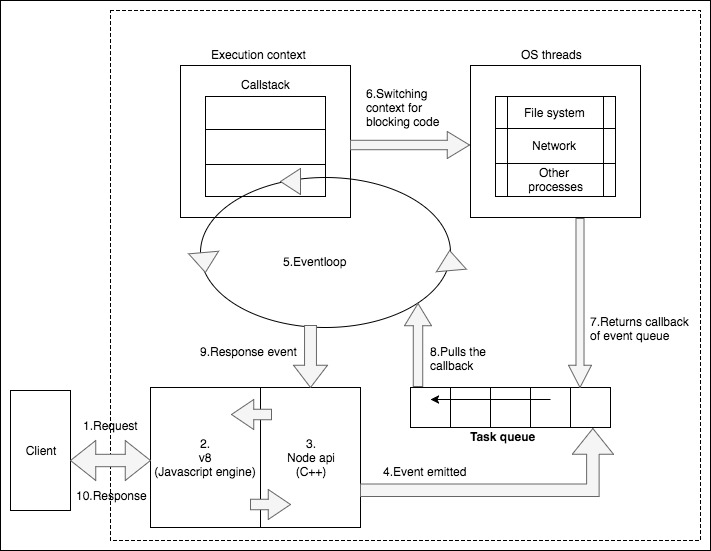
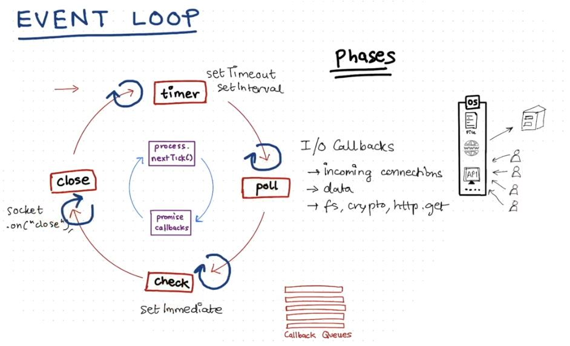

# What is Node?
    # Nodejs was developed by Ryan Dahl in 2009 and now managed by Nodejs foundation.
    # Until recently we could run JS code only in a web-browser (client side). Node is JS runtime that executes JS code outside of the browser.
    # JS was designed to run within web browsers, executed by the browser's JS engine (like V8 in Chrome). There was no standalone JS runtime environment for server-side execution.
    # Also, JS in the browser lacked the necessary APIs and libraries required for server-side operations such as file I/O, networking, and process management.
    # For server side, languages used are Java/Python/Ruby/Php, etc. But now JS can be used in server side too with the help of NodeJs.
    # Even before node we had Netscape's 'Livewire Pro Web' which can do the same but only for linux and macos.
    # Nodejs has event driven architecture capable of asynchronous/Non-blocking I/O. 

# V8 engine:
    # It is Google's open source JS engine. That is it executes JS code. V8 engine has parser, Interpreter, compiler to execute the JS code.
    # It is used in chrome, Node.js, etc. 
    # V8 can be embedded into any C++ application.    
        # While V8 is primarily written C++, Node.js is written in JS and C++ with V8 embedded into it.
        # The flow: JS code is executed and compiled to machine code by V8.
    # But V8 is purely a JS engine, meaning its main purpose is to run JS and hence lacks other functionalities needed for things like networking, file handling, etc., which are necessary for building server-side applications.
    # Node.js fills the gap of V8. It adds features on top of V8 through built-in modules (or APIs).
    # To simply put V8 is just a dependency with Node.js

# What can we build with Node?
    1. Web servers
    2. Command Line Tools
    3. Native Apps
    4. Video games
    5. Drone Software, etc.

# Node.js architecture - Event driven:

The process is almost similar to browser environment. Like how the call stack, event-loop and task queues work. But We have a library here called libuv to manage the async requests. Libuv provides access to thread-pool which has size of 4 threads by default. Its job is similar to web api's in browser environment. That is both are for managing the async requests. 
    # The client sends a request (consider an HTTP request). 
    # The Chrome's v8 engine is a just-in-time (JIT) compiler. Once the request is received at the server, v8 converts the JavaScript code to the machine code.
    # The C++ APIs within the Node.js provide a binding for other system-level components. Binding is basically a wrapper library so that a code written in one language can communicate with a code written in another language. This API is responsible for emitting an event. 
    # Once the event is emitted, it is stored in the event queue. The eventloop is responsible for fetching the event from the queue and executing it in the callstack.
    # If an event requires an asynchronous operation to be done, such as using database files, it switches its execution context to another worker thread and gets executed. This is done by libuv. The libuv library is responsible for handling the asynchronous behavior of an event life cycle in the system. It is written in C. It maintains a pool of threads to handle asynchronous requests such as I/O and network-related operations.
    # Once the asynchronous operation is completed, it returns the callback. The callback remains in the event queue until the callstack gets empty. Once the callstack is empty, the eventloop pulls the callback from the event queue and executes it in the callstack.
    # Eventually, the event returns the data to the Node API.
    # In each loop, it performs a single operation. Though the operations are performed sequentially, this single-threaded mechanized eventloop is so fast that it provides an illusion of concurrency. A single thread can utilize a single core of the system; hence, it provides better performance and minimal response time to client.

# Thread pool:
    # In Node, there are two types of threads: one Event Loop (aka the main loop or main thread), and a pool of 'k' Workers in a Worker Pool (aka the thread pool). 
    # The libuv library maintains a pool of threads that are used by node.js to perform long-running operations in the background, without blocking its main thread.

# Nodejs - Single threaded or Multi-threaded?
    # while Node.js is single-threaded in terms of its main event loop, it leverages additional threads through libuv. 
    # So we can say the Node.js is single threaded for synchronous operation but multithreaded for asynchronous operations. Lets look at the process.
    
# Broswer's environment vs Nodejs Environment
    # In the Browser Environment,
        # Event Loop, Task Queue, and Microtask Queue are part of the browser's runtime environment itself.
        # The browser handles these features directly to manage asynchronous operations like network requests, timers, and user events.
        # Web APIs in the browser (like setTimeout, fetch, addEventListener, etc.) provide asynchronous capabilities and interact with the event loop and task queues.
        # Flow: Both synchronous and asynchronous operations are transformed into events and placed in the event queue which is then picked up by event-loop. While synchronous operations are directly executed on the call stack, asynchronous operations are offloaded to libuv, and their callbacks are placed in the task queue for later execution.
    # In the Node.js Environment,
        # Node.js doesn't natively include an Event Loop or Task Queues by itself. Instead, it relies on the Libuv library to provide these features.
        # Libuv is the library responsible for the Event Loop, Task Queues, and handling asynchronous operations like file system access, networking, and timers.
        # Libuv enables Node.js to handle non-blocking I/O and asynchronous tasks in a similar way to how the browser handles them, but for server-side operations.
        # Flow: Synchronous code is executed directly on the call stack. Event Loop comes into play for asynchronous operations. When an asynchronous operation (like a setTimeout, AJAX call, or event listener) completes, its callback is placed in the task queue which is then later pushed on to call stack.

# Event-loop in detail:

In a browser environment we have only two queues from which event loop picks up and pushes to call stack. But in Node.js environment we have multiple phases (4 are significant - timers, poll, check and close) and each phase has their own queue. 
For every asynchronous operation, the callback will be added to the respective queue and every synchronous operation will be directly added to the callstack.  The order of priority is as follows. 
Flow: Phase 1 -> Process.nextTick() -> Promise Callbacks -> Phase 2 -> Process.nextTick() -> Promise Callbacks -> ..... Phase n. But there is an exceptions which is dealt in the respective phases.
    1. Timers: 
        # This phase executes callbacks scheduled by setTimeout() and setInterval().
    2. Pending callbacks: 
        # This phase executes callbacks for some system operations such as types of TCP errors. For example if a TCP socket receives ECONNREFUSED when attempting to connect, some *nix systems want to wait to report the error. This will be queued to execute in the pending callbacks phase.
    3. Idle, prepare: 
        # Only used internally. When the event-loop is idle it will wait at the poll phase (Unlike event-loop in browser environment which is always running)
    4. Poll: 
        # This phase executes I/O related callbacks, except those scheduled by timers (setTimeout, setInterval) and setImmediate.
            # Example: System operations, network requests, and other asynchronous I/O tasks.
        # Scenario 1: The Poll Queue has callbacks to execute
            # The event loop goes through the queue and runs those callbacks synchronously one after another.
            # It will keep doing this until either,
                # The queue is empty: All the callbacks have been executed.
                # A system limit is reached: There is a hard system limit to how long the loop will process items in the queue, which prevents it from running indefinitely.
        # Scenario 2: The Poll Queue is empty
            # If the queue is empty, there are two possible things that can happen:
            # Are there scripts scheduled by setImmediate()?
                If setImmediate() has scheduled any scripts, the event loop will leave the poll phase and move to the check phase (which is where setImmediate() callbacks are executed).
            # If no setImmediate() scripts are scheduled:
                The event loop will wait for new I/O events (e.g., incoming network requests, file reads, etc.) and as soon as something happens, it processes it. If nothing happens, the event loop will just keep waiting for callbacks to be added.
        # Timers and the Poll Phase:
            # Once the poll queue is empty, the event loop checks if any timers (like those set by setTimeout() or setInterval()) have hit their time threshold.
            # If timers are ready, the event loop wraps back to the Timers Phase to execute their callbacks.
                # The event loop in Node.js does not always move in a strict forward direction through its phases. Instead, it can "move back" or jump between phases when needed, depending on what tasks are waiting to be executed. 
                # So when the timers are ready it moves backwards and in scenario 2 when the setImmediate() has scheduled any scripts it will jump from the poll phase and move to check phase. These are the two exceptions where the flow is broken (moving forward/completion of phase to move to the next phase).
    5. Check: 
        # SetImmediate() callbacks are invoked here.
        # setImmediate() is a special kind of timer, specifically designed to run after the poll phase but before the event loop returns to the timers phase.
        # It uses libuv to ensure these callbacks run as soon as the poll phase finishes, avoiding unnecessary waiting.
        # This behavior makes setImmediate() particularly useful when you want to run some code as soon as possible, but not within the current phase of the event loop.
        # So, once the event loop finishes the poll phase and becomes idle, it checks if there are any setImmediate() callbacks. If there are, it jumps to the check phase to execute them.
            # setImmediate() vs setTimeout(): setImmediate() is designed to execute a script once the current poll phase completes. setTimeout() schedules a script to be run after a minimum threshold in ms has elapsed.
    6. Close: 
        # Close callbacks are executed  
        # Example: socket.on('close', ...)
process.nextTick():
    # It is not technically part of the event loop that is why it is not listed among the phases
    # After every phase, process.nextTick() will be executed and nextTickQueue will be processed.
    # Once it s completed any promise call backs will be executed.
    # nextTick() has the highest priority and promise callbacks has the second highest priority. If multiple nextTicks()/promise callbacks are nested within each other all of them will be executed before proceeding to the next phase.

# Important takeaways:
Don't block the main thread: That is if we are performing CPU-intensive tasks like complex calculations or working with large datasets, we have to make sure to handle them asynchronously.

# Starting node:
    # Just type node and hit enter in CLI. This environment is called as node REPL.
    # Node REPL (Read-Evaluate-Print-Loop) is an interactive CLI that comes with Node.js. Once you enter the command "node", CLI goes into REPL mode. It allows you to interactively execute JavaScript code, line by line, and see the results immediately. The REPL environment is useful for testing out code snippets, exploring JS features, and debugging.
    # We can just type the typical JS code within CLI (Just as we type it in the console of a browser)
    > .help
        # .break   -  Sometimes you get stuck, this gets you out
        # .clear   -  Alias for .break
        # .editor  -  Enter editor mode
        # .exit    -  Exit the REPL
        # .help    -  Print this help message
        # .load    -  Load JS from a file into the REPL session
        # .save    -  Save all evaluated commands in this REPL session to a file
    # Executing the file: node fileName/pathToTheFileName 
        # Example: node test.js or node "C:\Users\Bharath Srinath\Documents\GitHub\web-development\node\test.js"

# Global object:
    # Browser has a global object known as 'window' that has a global scope in JS. Similarly Node.js too has a global object known as 'global' that has a global object. 
    # window, this, self and frames - all refer to the same window object when used at the global scope in a browser environment. 
        # 'this' keyword used at the global level in browser environment refers to window but in a Node.js environment refers to an empty object.   
    # 'globalThis' is a standardized keyword that provides a consistent way to refer to the global object across different JS environments, including browsers, Node.js, and other JavaScript runtimes. 

# Modules:
    # Modules in Node.js are reusable blocks of code that are encapsulated and can be imported or exported between files.
    # They allow you to break your code into smaller, manageable parts and reuse functionality across different parts of your application.
    # Types of Modules:
        1. Core Modules: Built-in modules provided by Node.js, such as fs, http, path, and os.
            Example: const moduleName = require('module-name'); or 
                     const moduleName = require('node: module-name');
        2. User-Defined Modules: Modules you create yourself. We can export functionality (variables, functions, classes) from one file and import it into another.
            Example: const myModule = require('./path/to/myModule');
        3. Third-Party Modules: Packages or libraries installed via npm, such as express, lodash, etc. We can install these modules and import them in your code.
            Example: const libraryName = require('library-name');
    # Module systems/formats: CommonJS (CJS) Modules and ECMAScript Modules (ESM or MJS) 
|----------------------------------------------------------------------------------------------|
|Feature     |  CJS                                 |  ESM/MJS                                 |
|------------|--------------------------------------|------------------------------------------|
|Import      |  require()                           |  import                                  |
|            |  const x = require('module')         |  import x from 'module'                  |
|------------|--------------------------------------|------------------------------------------|
|Export      |  module.exports                      |  export                                  |
|            |  module.exports = x or exports.x = x |  export default x or export { x }        |
|------------|--------------------------------------|------------------------------------------|
|Sync/Async  |  Modules are loaded and executed     |  Modules are loaded asynchronously (but  | 
|            |  synchronously                       |  can be used for sync execution too)     |
|------------|--------------------------------------|------------------------------------------|
|mode        |  Follows unstrict mode               |  Follows strict mode by default. (that is|
|            |                                      |  cannot declare a variable without       |
|            |                                      |  initialisation)                         |
|------------|--------------------------------------|------------------------------------------|
|future      |  Older way but industry standard as  |  Newer way and will become the           |
|            |  of today                            |  inudstry standard in few years.         |
|----------------------------------------------------------------------------------------------|   

# Modules behind the scenes:
    # When you use require, the entire module is wrapped into a function. Now just like a normal function, variables, objects and other functions inside the that wrapper function are scoped to that function. That is they cannot be accessed outside. 
    # This is to ensure variables, functions, and objects defined in the module do not pollute the global namespace.
    # To access them we have to use exports.module. So a combination of 'require' and 'exports.module' is required to access the the functions, variables and objects of a module.
    # This wrapper function is an Immediately Invoked Function Expression (IIFE).
    # Steps:
        1. Resolving the module (determines from where does the module comes from). It looks in the following places in order:
            # Built-in modules (like fs, http).
            # Local files (Ex: ./module.js).
            # Node modules in the node_modules directory.
        2. Loading the module (modules code is loaded according to the file type)
        3. Wraps inside IIFE
        4. Code evaluation
        5. Caching (The next time we require() the same module, Node.js retrieves it from the cache instead of reloading and re-executing it.)

# fs Module:
    # It allows us to perform various file-related operations such as reading from and writing to files, creating directories, and managing file permissions. 
    # This module is part of the Node.js core, so we don't need to install any additional packages to use it. Just use this at the top of the file "const fs = require('fs');".
    # There are extremely large number of commands. We will look at some of them.
        1. Reading Files: fs.readFile() and fs.readFileSync()
                fs.readFile('example.txt', 'utf8', (err, data) => {
                    if (err) {
                        console.error(err);
                        return;
                    }
                console.log(data);
                });
            example.txt is the filename. utf8' specifies the character encoding to be used while reading the file. UTF-8 character set supports a wide range of characters from various languages. Other values are ascii, utf16le, latin1/binary, null/undefined, etc. (err, data) is the callback function.
        2. Writing Files: fs.writeFile() and fs.writeFileSync()
                fs.writeFile('example.txt', 'Hello, Node.js!', (err) => {
                    if (err) {
                        console.error(err);
                        return;
                    }
                console.log('File written successfully.');
                });
        3. Working with Directories:
                fs.mkdir('example', (err) => {
                    if (err) {
                        console.error(err);
                        return;
                    }
                console.log('Directory created successfully.');
                });
                fs.readdir('example', (err, files) => {
                    if (err) {
                        console.error(err);
                        return;
                    }
                console.log('Files in the directory:', files);
                });
        4. Checking if a File or Directory Exists:
                if (fs.existsSync('example.txt')) {
                    console.log('File exists.');
                } else {
                    console.log('File does not exist.');
                }
    # Sync functions will block main thread. As a developer you may not use that in your lifetime. But just know it exists. 

# process object:
    # It is a global object that provides information and control over the current Node.js process. 
    # It allows you to access various details about the running process, interact with the environment, and control the execution flow.
    # One commonly used property of the process object is argv (argument vector). It is an array that contains the command-line arguments passed to the Node.js process. The first two elements of the array are:
        1. The path to the Node.js executable. (node)
        2. The path to the JavaScript file being executed. (fileName)
    # After these initial elements, the rest of the array contains any additional command-line arguments provided when running the Node.js script.

Example.js
console.log('The path to the Node.js executable:', process.argv[0]);
console.log('The path to the JavaScript file being executed:', process.argv[1]);
console.log('Command-line arguments:', process.argv.slice(2));
    # slice is to exclude argv[o] and argv[1] and consider the rest

CLI: node example.js arg1 arg2 arg3

Output:
The path to the Node.js executable: /path/to/node
The path to the JavaScript file being executed: /path/to/example.js
Command-line arguments: [ 'arg1', 'arg2', 'arg3' ]

    # process.cwd() => Prints the working directory
    # process.cwd(..) => Goes back one directory
    # process.chdir("Path") => Changes the directory. The path should have forward slashes or double backslashes.

# NPM:
    # They are basically a library of thousands of packages published by other devlopers that can be used by us in our project.
    # Just type 'npm' and hit enter in CLI to see the list of commands that we can use with npm.
        # Example: npm install packageName, npm unistall packageName
    # package.json is a metadata file that provides information about a Node.js project. It includes details about the project, such as its name, version, entry point, scripts, and dependencies. We can create package.json with a command 'npm init'. But when you install node.js, it is automatically created (latest update).

# Local vs Global installation of packages:
    # Locally install packages in a project directory as often as you can. Because you may work with different projects each of which require different versions. Newer versions may not work woth projects that depend on older version
    # But if at all you want to install globally, add this -g tag
        # Example: npm install -g packageName 

# Server
    # The term "server" can refer to both hardware and software, depending on the context.
        # Hardware: A physical machine (computer) that provides resources and services to other computers (clients) over a network.
        # Software: An application or program that handles requests and delivers data to clients.
    # When someone says "deploy your app on a server," they usually mean: 
        # Hardware Aspect: You need a physical machine (server) to run your application. This machine has a CPU, RAM, storage, etc.
        # Operating System: The server hardware runs an operating system like Linux or Windows. Our application runs on this OS.
        # Server Software: The software that handles requests from users.
            # Example: Web server like Apache or an application server built with Node.js
    # Cloud platforms like AWS, GCP are bascially renting out their virtual servers. They manage the underlying hardware, and we deploy our application on the virtual server.
    # In large companies, the architecture is often distributed across multiple servers rather than relying on a single server. This approach helps manage different aspects of the application efficiently and ensures scalability, reliability, and performance
        # Examples: Frontend Server, Backend Server, Database Server, Media and File Servers, etc.

# Express
    # Express is a Node.js Web Framework for creating server side application.
        # Libary: It is a collection of pre-written code that developers can use to optimize tasks. It provides specific functionality that you can call from your code. We are in control of the flow of the application code and we decide when to use the library.
        # Framework: It is a larger collection of code that provides a structure for your application. It dictates the architecture of your application and comes with a set of rules and guidelines. Here the control is inverted. The framework is incharge and we are merely a participant. It tells you where to plug in the code. 
        # Package: It is a bundled collection of code that can be reused and distributed. It can be a library, a framework, or even a small utility or module. 
    # Uses:
        1. Starts a server to listen for request
        2. Parse incoming requests
        3. Match those request to particular routes
        4. craft our http reponse and associated content
# nodemon
    # It is a utility for Node.js that helps in the development process by automatically restarting the Node application when file changes are detected. 

# Express methods
    1. HTTP Methods
        # app.get(path, callback): Defines a route for GET requests.
        # app.post(path, callback): Defines a route for POST requests.
        # app.put(path, callback): Defines a route for PUT requests.
        # app.delete(path, callback): Defines a route for DELETE requests.
        # app.patch(path, callback): Defines a route for PATCH requests.
        # app.options(path, callback): Defines a route for OPTIONS requests.
        # app.head(path, callback): Defines a route for HEAD requests.
        # app.all(path, callback): Defines a route for all HTTP methods.
    2. Middleware and Routing
        # app.use(path, middleware): Mounts middleware functions or an entire application at the specified path.
        # app.route(path): Returns an instance of a single route, which you can then use to handle HTTP verbs with optional middleware.
        # app.param(name, callback): Adds callback triggers to route parameters, where name is the name of the parameter and callback is the callback function.
    3. Settings and Configuration
        # app.set(name, value): Sets the value of app settings.
        # app.get(name): Gets the value of app settings.
        # Application-Level Middleware
        # app.use(middleware): Mounts middleware functions at the application level.
    4. Template Engines
        # app.engine(ext, callback): Registers the given template engine callback as ext.
        # app.set('view engine', 'ext'): Sets the default engine extension to use when omitted.
    5. Utility Methods
        # app.listen(port, [hostname], [backlog], [callback]): Binds and listens for connections on the specified host and port.
        # app.locals: An object containing local variables for the application.
    6. Error Handling
        # app.use(errorHandler): Defines error-handling middleware.

# HTTP request:
    # An HTTP request is initially a text-based message sent from the client to the server. A server-side framework like Express takes that request (req), parses it into an object that is easy to work with in JavaScript/other server-side langauges, and then allows you to send a response (res) back to the client.
    
# The .use() method in Express is used to add middleware functions to our application.
    # Middleware functions are special functions that have access to the incoming request (req) and outgoing response (res) objects in an Express application. They are basically processes that occur between request and response. 
    # They are used for tasks like logging, authentication, modifying requests or responses, and more.
    # built-in middleware functions: 
        # express.static for serving static files
        # express.json for parsing JSON in the request body
        # express.urlencoded for parsing URL-encoded data, etc.

# .use() method:
It can two arguments. 
    1. An optional path or a pattern of paths for which the middleware function should be invoked. If a path is provided, the middleware function will only be executed for requests that match the specified path. If no path is provided, the middleware function will be executed for all requests.
        # Example: app.use('/example', (req, res, next) => {...})
    2. Callback Function:
        # This function is called the middleware function and can take 3 arguments 
        # It is executed for each incoming request that matches the specified path (or for all requests if no path is provided). 
        # It receives the request (req), response (res), and next parameters.
            # Example: app.use((req, res, next) => {...})
        # Next is a callback function that, when called, passes control to the next middleware in the stack.
    # You know .use() method runs for every request for the path that is proivded (and no path means it literally runs for everything). But still the order matters. By defining them at different places we can achive different things. 
        # Example: We have app.use((req,res,next){next()}), app.use('/dogs', (req,res,next){next()}), app.use('/cats', (req,res,next){next()}), at the top. Also we have get and put methods with the above routes and finally we have app.use((req,res)){res.send('NOT FOUND')}. Now when we search for route '/tiger', first app.use will be executed, and it will skip all since the route doesn't match and execute the lost with the message 'NOT FOUND'. So by placing them at the correct position, we can create these types of features.
(You can see the sample codes in 3.express/middleware.js file)
    # Next(): The way Next() works depends on the method, route and the parameters of the callback function.
        # A middleware with 'use' method will pass the 'next' to the subsequent middlware 'use' method
        # If the route is '/secret' and method is 'use', then 'next' will pass it to the subsequent middleware with 'use' method and '/secret' route.
        # If you get an error by performing any logic inside a middleware or when the user is trying to access an inavlid route, express will look for an 'error handling middleware' or you should handle that with a try catch block. If you haven't done any, express will implement the default error handling.
            # An error handling middleware doesn't have a route. So Whenever there is an error in a middleware, Express automatically forwards it to the error-handling middleware and display the message based on our customisation. 

# morgan middleware:
    # It is the 3rd party middleware package which is used for logging the incoming request method, response time, etc.
    # After installing the package we can just use it as as following. It will be useful during development.
        # app.use(morgan('tiny')) 
        # There are many other options instead of tiny. You can use 'dev' too.
        # Different options may provide different information or same information in different format

# .use() vs routing methods
    # Both .use() and routing methods are methods that defines/registers middlewares and handle requests and responses. But they serve different purposes.
        # .use() methods are used for operations that need to be performed for all paths of the route, while routing methods handle requests to specific paths. Also, app.use() can handle all types of HTTP requests (GET, POST, PUT, DELETE, etc.), while app.get/post/put/patch/delete() is specifically for handling GET requests.
        # Imaginary Example: Http routing methods are like a door to a specific room in a house. When we knock on that door (send a GET request to a specific path), the door opens (the server responds) and we see what’s inside the room (the response from the server). But .use() is like a hallway in a house. No matter which room we want to go to, we have to pass through this hallway. So, every time we make any request (GET, POST, etc.), we are going to pass through the middleware defined by i.use(). It’s a common area that every request will go through, no matter which door (path) it eventually knocks on.
    # So, if we have something that we want to apply to many different paths (like checking if a user is logged in, or logging details about the request), we would put it in app.use(), because all requests pass through there. But if we have something specific to a certain path (like sending a specific response when the user visits the home page), we would put it in app.get() for that specific path.
            
# Templating
    # Templating is a technique used in web development to separate presentation (HTML/CSS) from logic(JS).
    # It allows us to inject dynamic data into your HTML which is useful for displaying user-specific data, form submissions, database queries, etc.
    # It allows us to reuse the same base layout across multiple pages which reduces code duplication.
    # Templates are written in a templating language that allows you to embed code inside HTML. 
    # We will be using EJS(Embedded JS). Others are Pug, Handlebars, Mustache.
    # In React, we use {} to embed JS expressions within JSX (we say that it escapes JSX). Similarly we use the tag <%= %> in EJS to embed JS expressions (HTML escaped). But there are other tags too.
        # <% %> : Used to enclose JS code but doesn't render the code. See in an html file we cannot add a JS logic like if (n%2 == 0) print("Even"). But when you enlcose the logic with this tag, we can add it.
Note: Install ejs extension in vscode for formatting purpose

# app.use(express.static(path.join(__dirname, 'public')))
    # It is a built-in middleware function to serve static files.
    # You specify a root directory ('public' by convention) from which static assets will be served.
    # It is highly efficient and useful for serving files needed by the frontend of your application without requiring you to write additional routing logic for each file type.
    # When a request is made to your server, Express will look for a matching file in the public directory. If it finds the file, it will be served directly to the client.
        # Example: If there is a file public/index.html, it can be accessed via http://localhost:3000/index.html
    # express.static: It is a built-in middleware in Express for serving static files. It tells Express to serve static files from a specified directory. When a client requests a resource (like an image, CSS file, or JS file), Express will look for the requested file in the folder you specify.
    # __dirname is a global variable in Node.js that gives the absolute path of the directory where the current file (usually the main Express app file) is located.
    # By using path.join(__dirname, 'public'), you're telling Express to look for the "public" folder inside the current directory where the main app file resides.
    # Express looks up the files relative to the static directory, so the name of the static directory is not part of the URL.
    # When we talk about static and dynamic in the context of serving files, we’re referring to something different.
    # A statically served file means that "the file is sent to the client exactly as it is stored, without any changes made to it on the server during the request-response cycle".
    # A dynamically served file means that "the file is generated or modified on the server during the request-response cycle before being sent to the client".
        # Dynamic content is specifically created on the server side, usually by making a database request and updating the page before it is sent to the user. This requires CPU processing on the web server.
        # Example: When a user logs into a website, the server might generate a personalized home page for that user.  

# app.set('view engine', 'ejs');
# app.set('views', path.join(__dirname, '/views'))
# set() method:
    # .set() is used for variable declaration and initialization where first argument is the variable name and second is the value stored in it.
    # Eventhough they can be used like a simple variable declaration and initialization, they are most commonly used to set specific properties that configure the Express application, such as 'view engine' or 'views'. 
# view engine():
    # The view engine setting specifies the template engine to be used by Express for rendering views. Template engines allow you to generate HTML dynamically by embedding JavaScript logic and variables within your HTML files.
    # When you set the view engine, Express internally configures itself to use the specified template engine when you call res.render().
    # It also helps us to avoid the usage of extension where we render like index.ejs. We can simply call res.render('index')
# views directory: 
    # express will always look for index.js within a folder named "views". So when we run the server from root directory, it is easy for express to find the views and the index.js file. But if you run the server from a different directory, Express might not find the "views" directory because relative paths can change based on the current working directory.
    # To prevent path issues, we set the views directory using an absolute path. So we are telling the express that whenever you are going to look for the views directory, don't choose the relative path, rather always look for the absolute path that we have set here. 
        # Here _dirname is a global variable in Node.js that contains the absolute path (simply the file path) of the directory that contains the currently executing file. 
            # Example (absolute path of this file): C:\Users\Bharath Srinath\Documents\GitHub\web-development\3.backend\node-stack\4.templating

# Partials
    # They are just reusbale html codes. For an example, in every html/ejs file we see the head is generally the same. We can import this into other html/ejs files rather than duplicating it everytime.
    # <%- inlcude( 'filename/path' ) %> is tag to include it. 
    # For a better structure, always create a folder called partials and place those files inside it.

# res.render():
# res.render(view [, locals] [, callback])
    # view: It is the .ejs file that will be rendered.
    # locals: It is used to pass variables to the view where view is the filename and locals is an object. (Additional explanation below (/random))
    # callback: It is called after the view is rendered. If you provide a callback, the rendered HTML is passed to it as the second argument. If there’s an error during the rendering process, the details of that error will be passed to the first argument 
    # Example:
        res.render('index', { title: 'Hey', message: 'Hello there!' }, function(err, html) {
            if (err) {
                console.log(err);
                res.send('An error occurred while rendering the view.');
            } else {
                res.send(html);
            }
        });
    
# app.use(express.urlencoded({ extended: true }))
# app.use(express.json())
    # For every post request that we send, we need to specify how do we need to parse the data. 
    # Remember that, data that we send are just treated as mere text. When we console.log(req.body), we will just see 'undefined' by default. 
    # In order to use this data effectively, we need to parse it into a format that our application can understand.
        # 1. JSON: To parse JSON data from the request body. 
            # express.json()
        # 2. URL-encoded: To parse data from the request body when the Content-Type is application/x-www-form-urlencoded. (When data is sent through forms)
            # express.urlencoded()
                # extended: true: This option allows for rich objects and arrays to be encoded into the URL-encoded format, using the qs library. It allows for deeper nesting and more complex data structures in your request body.
        # 3. Text: To parse text data from the request body. 
            # bodyParser.text()
        # 4. Raw: To parse data from the request body without any specific encoding.  
            # bodyParser.raw()
        # 5. Multipart/Form-data: To parse multipart/form-data from the request body, which is primarily used for uploading files. We can use multer middleware for this.

# app.use(methodOverride('_method'))
    # To 'fake' put/patch/delete requests: 
    # HTML forms allows only GET and POST request. So to trick that we have to install and import a libray called method-override (npm install method-override).
    # Now in HTML form will still use method = POST
    # But action attribute will be appended with a query string - "?_method=PUT" or "?_method=PATCH" or "?_method=DELETE"
        # Example: <form method="POST" action="/comments/<%=comment.id%>?_method=PATCH">

# Get vs Post
    1. GET:
        # It is mainly used on the client (Browser) side to send a request to a specified server to get certain data or resources1.
        # The server should only let us receive the data and not change its state.
        # The request parameter of the GET method is appended to the URL.
        # It can be cached, remain in the browser history, and can be bookmarked.
        # It should never be used when dealing with sensitive data.
        # They have length restrictions.
        # They are only used to request data (not modify).
    2. POST:
        # It is mainly used at the client (Browser) side to send data to a specified server in order to create or rewrite a particular resource/data.
        # This data sent to the server is stored in the request body of the HTTP request.
        # They are never cached, do not remain in the browser history, and cannot be bookmarked.
        # They have no restrictions on data length.
        # They can handle ASCII characters as well as binary data.
        # It is a little safer than GET because the parameters are not stored in browser history or in web server logs.

# Put vs Patch
    1. PUT:
        # PUT is used to update an entire resource.
        # If the resource does not exist, PUT can create a new resource.
        # PUT is idempotent(read it as 'i(e)dam potent'), meaning calling it once or multiple times successively has the same effect.
            # Example: If you want to update a user’s name and email, you have to send all the parameters of the user, including those not to be updated, in the request body. It will update the content to be edited and replace the rest with the same content.
    2. PATCH:
        # PATCH is used to update partial data within a resource.
        # PATCH only updates the fields that were included in the request body.
        # PATCH is not idempotent, meaning the outcome might be different if we call it multiple times in a row.
            # Example: If you want to update a user’s email, you only need to send the new email in the request body.

# REST - Representational State Transfer
    # It is an architectural style to a separate protocol like HTTP. To understand this we have to know what existed before REST => SOAP (Simple Object Access Protocol)
    # In a SOAP-based web service, you would typically send different SOAP messages (in an XML document) to the same endpoint (same URL like www.example.com) to perform different operations or interact with different resources. The specific operation or resource is determined by the content of the SOAP message, not the URL.
    # In a RESTful web service, each resource has its own unique URL (like www.example.com/books/1 for the first book, www.example.com/books/2 for the second book, etc.). The operation you want to perform (like getting information about a book, updating a book, deleting a book, etc.) is determined by the HTTP method (like GET, POST, PUT, DELETE) you use when you make the request.
    # So the simple understanding for REST is using specific URLs (also known as “endpoints”) to represent resources, and different HTTP methods (like GET, POST, PUT, DELETE) to represent operations you can perform on those resources. Look at the below example. Here we are using comments as a resource
        # GET /comments - display all comments
        # POST /comments - Create a new comment 
        # GET /comments/:id - Get one comment (using ID)
        # PATCH /comments/:id - Update one comment
        # DELETE /comments/:id - Destroy one comment

# REST over SOAP - Why?
    # REST Uses standard HTTP methods (GET, POST, PUT, DELETE) which makes it stateless and hence highly scalable whereas SOAP can maintain stateful operations via sessions, which can complicate scalability and load balancing.
    # REST Can use multiple data formats (JSON, XML, plain text, HTML) while SOAP strictly uses XML.
