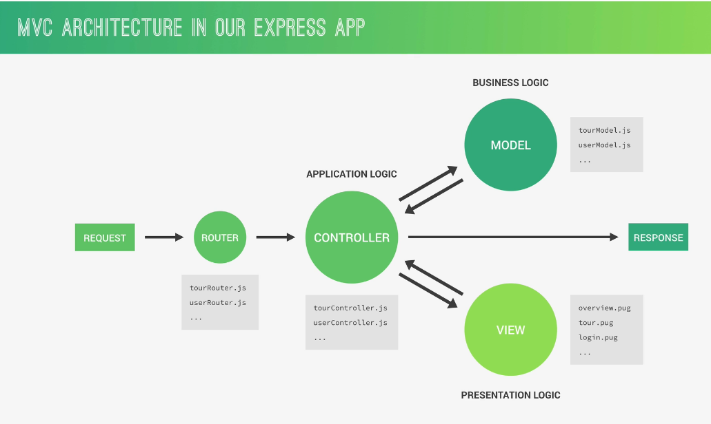
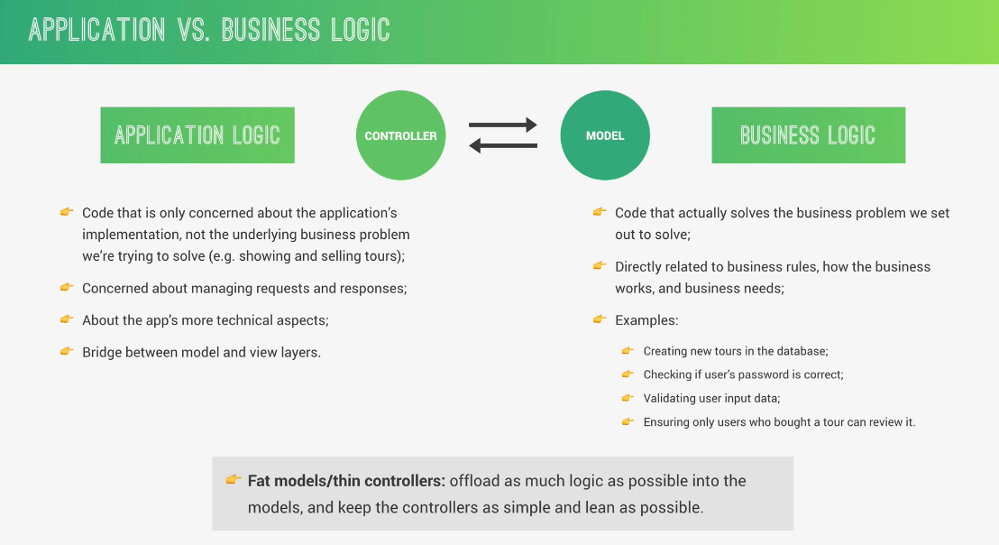

# Database
    # They can store large amounts of data efficiently and store it compactly.
    # They provide tools for easy insertion, querying and updating the data.
    # They geenrally offer security features and control overall access to data.
    # They scale well (generally).

# Broad categories: SQL vs NoSQL
    1. Structured Query Language (SQL):
        # They are primarily called Relational Databases (RDBMS) where everything is stored in tables and one table is related to another  with a common property.
        # They are vertically scalable, which means that we can increase the load on a single server by increasing things like RAM, CPU, or SSD.
        # They follow ACID properties (Atomicity, Consistency, Isolation, and Durability).
            # Examples: MySQL, Postgres, SQLite, Oracle, Microsoft SQL Server
    2. No Structured Query Language (NoSQL):
        # They are primarily called non-relational or distributed databases where they have a dynamic schema for unstructured data.
        # They are horizontally scalable, meaning you handle more traffic by sharding, or adding more servers in our NoSQL database.
        # They can be document-oriented, column-oriented, graph-based, or organized as a key-value store.
        # They follow the Brewers CAP theorem (Consistency, Availability, and Partition tolerance).
            # Examples: MongDB, CouchDB, Neo4j, Cassandra, Redis

# MongoDB:
    # Document-Oriented: Data is stored as documents, and documents are grouped in collections. Documents are self-contained and can be treated as objects.
        # Self contained here is opposite to the table format where the data is spread across multiple tables and are linked through relationships. Here just imagine an object with properties. Each property by itslef can be an object and any property within that object can also be an object  and this nesting can go on. But all the data is at one place.
    # The documents in a single collection don’t necessarily need to have exactly the same set of fields. (That is the objects can have different properties)
    # Documents are stored in the BSON format, which is a binary-encoded JSON format. This means that the data is stored in a binary format, which is much faster than JSON.
    # In the MongoDB server, you are allowed to run multiple databases. 

# Installation  and initial setup of MongoDB:
    # Download both with default configuration
        # Server: https://www.mongodb.com/try/download/community 
        # Shell: https://www.mongodb.com/try/download/shell
    # Type 'mongosh' in bash. This will connect to the server and the shell that you are seeing is a JS shell where you can type JS code.
    # 'Show dbs/databases' will give you the existing databases (There are few by default)
    # 'use dbName' to create and switch to that db. But until we put some data into it, it won't be shown among the list of databases. 
    # 'db' will show in which database we are in
    # 'show collections' will show the list of collections that we have within the database.
        # Example: Lets say we have a database names 'animal'. Within that collections can be cats, dogs, etc. Within cats we can have multiple documents

# CRUD operations
    1. INSERT:
        # db.dogs.insertOne({name: "Mac", age: 7}) = Inserts one document to the database
        # db.dogs.insertMany({name: "Ronaldo", age: 7}, {name: "Tarren", age: 3})
    2. FIND:
        # db.dogs.find({}) = Lists out all the dogs
        # db.dogs.find({age: 7}) = Lists out dogs with age 7
    3. UPDATE:
        # db.dogs.updateOne({name: "Mac"}, {$set: {age: 8}, $currentDate: {lastModeified: true}})
            # Here, first argument is the property that you can use to find the document
            # Second argument is the $set operator whose value should the "property and updated value" of the document. There is an optional second operator called $currentDate which will log the modified date and time.
        #  db.dogs.updateMany({name: "Mac"}, {$set: {age: 8, breed: "Country dog"}, $currentDate: {lastModeified: true}})
            # There is no property called breed. But the above command will add the new property
    4. DELETE:
        # db.dogs.deleteOne
        # db.dogs.deleteMany

# Finding/Querying in Detail:
    Lets consider the following dataset.
    db.inventory.insertMany([
        { item: "journal", qty: 25, size: { h: 14, w: 21, uom: "cm" }, status: "A" },
        { item: "notebook", qty: 50, size: { h: 8.5, w: 11, uom: "in" }, status: "A" },
        { item: "paper", qty: 100, size: { h: 8.5, w: 11, uom: "in" }, status: "D" },
        { item: "planner", qty: 75, size: { h: 22.85, w: 30, uom: "cm" }, status: "D" },
        { item: "postcard", qty: 45, size: { h: 10, w: 15.25, uom: "cm" }, status: "A" }
    ]);
    # db.inventory.find( {} ) => It will list all the documents
    # db.inventory.find( { status: "D" } ) => Lists only the documents with status property whose value is "D"
    # db.inventory.find( { status: { $in: [ "A", "D" ] } } ) => Status property with value "A" or "D"
    # db.inventory.find( { status: "A", qty: { $lt: 30 } } ) => qty that is less than 30
    # db.inventory.find( { $or: [ { status: "A" }, { qty: { $lt: 30 } } ] } ) => Documents with status value to be "A" or qty less than 30.
    # db.inventory.find( { status: "A", $or: [ { qty: { $lt: 30 } }, { item: /^p/ } ]} ) => It selects all documents in the collection where the status equals "A" and either qty is less than ($lt) 30 or item starts with the character p:
    # db.inventory.find( { "size.uom": "in" } ) => Access to the nested object is using the method operator.
    # db.inventory.find( { "size.h": { $lt: 15 }, "size.uom": "in", status: "D" } ) => Another example for AND. Note that we dont explcitly mention the word AND in MongoDB unlike SQLite.
    # db.inventory.find( { tags: ["red", "blank"] } ) => queries for all documents where the field tags value is an array with exactly two elements, "red" and "blank", in the specified order
    # db.inventory.find( { tags: { $all: ["red", "blank"] } } ) => looks for array that contains "red" and "blank" not necessarily in the same order and it may contain additional tags too.
There are many more. Please look at https://www.mongodb.com/docs/manual/crud/

# Mongoose ODM:
    # An ODM is a tool that maps your objects in the application to documents in the database. ODM library provides us a way to write a programming language that can interact with our database. 
    # Functioning:
        1. Define a schema (a blueprint) for your documents.
        2. Create a model based on that schema.
        3. Create instances of the model which are the actual documents.
        4. These documents can be saved, retrieved, updated, and deleted in the database using methods provided by the ODM.
    # Example: Let’s say we want a “users” collection in our MongoDB database, and each document in that collection represents a user with properties like name, email, and age. We can use an ODM to create a “User” model, define the user’s schema, and use that model to create new users, fetch them from the database, update them, and delete them. Instead of using MongoDB commands to work with the data, we can use the methods provided by the model, which are more straightforward and intuitive.
    # Note (Just know it): 
        # MongoDB is an object/document oriented. Hence it can be used with other object oriented languages too.
        # Based on the language, we have different ODM's for MongoDB
            1. Mongoose: Node.js 
            2. Beanie: Python
            3. Doctrine: PHP
            4. Morphia: Java
    # Installation: npm install mongoose

# Steps to create a database using Mongoose:
    1. Import mongoose => "const mongoose = require('mongoose')"
    2. Connect to MongoDB using the mongoose.connect('mongodb://localhost:27017/dbName')
    3. Define a Schema: A schema defines the structure of our documents. You can define a schema using new mongoose.Schema()
        # Example: const movieSchema = new mongoose.Schema({
                        title: String,
                        year: Number,
                        rating: Number
                    });
    4. Create a Model: A model is a constructor compiled from a schema. We can create a model using mongoose.model()
        # .model() can take two arguments. First argument is the singular name (It cannot be plural). When we save the created model, .model() will automatically create a collection whose name is the plural form of first argument. Second argument is the schema based on which the model will be created.
    5. Use the Model: Now that we have a model, we can use it to create, read, update, and delete documents in our database.    
        # Example: const myMovie = new Movie({ title: 'Inception', year: 2010, rating: 8.8 });
                    myMovie.save(function (err, myMovie) {
                        if (err) return console.error(err);
                        console.log('Movie saved successfully!');
                    });

# CRUD in Mongoose:
1. Model.deleteMany(filter, options, callback): Deletes all documents that match the given filter. 
    Example: await Character.deleteMany({ name: Stark, age: { $gte: 18 } }); // returns {deletedCount: x} where x is the number of documents deleted.

2. Model.deleteOne(filter, options, callback): Deletes the first document that matches the given filter. 
    Example: await YourModel.deleteOne({ name: 'John Doe' });

3. Model.find(filter, projection, options, callback): Returns all documents that match the given filter. 
    Examples: 
        await MyModel.find({}); // find all documents
        await MyModel.find({ name: 'john', age: { $gte: 18 } }).exec(); // find all documents named john and at least 18
        await MyModel.find({ name: /john/i }, 'name friends').exec(); //  case-insensitive matching for the string "john" and next is the projection parameter (name and friends) will make sure that the query returns only the document with name and length parameters..

4. Model.findById(id, projection, options, callback): Returns the document with the provided id. 
    Examples: 
        await Adventure.findById(id).exec(); // Find the adventure with the given `id`, or `null` if not found
        await Adventure.findById(id, 'name length').exec(); // select only the adventures name and length

5. Model.findByIdAndDelete(id, options, callback): Deletes the document with the provided id and returns the deleted document. 
    Example: let deletedDoc = await YourModel.findByIdAndDelete('document_id');

6. Model.findByIdAndRemove(id, options, callback): Similar to findByIdAndDelete(), it deletes the document with the provided id but doesn't return the deleted document. 
    Example: let removedDoc = await YourModel.findByIdAndRemove('document_id');

7. Model.findByIdAndUpdate(id, update, options, callback): Updates the document with the provided id and returns the updated document. 
    Example: 
        Model.findByIdAndUpdate(id, { name: 'jason bourne' }, options)
            // options can be 'before' and 'after' (By default, it will return the document before the update was applied)

8. Model.findOne(filter, projection, options, callback): Returns the first document that matches the given filter.
    Examples: 
        await Adventure.findOne({ country: 'Croatia' }).exec();  
            // Find one adventure whose `country` is 'Croatia', otherwise `null`
            // Model.findOne() no longer accepts a callback
        await Adventure.findOne({ country: 'Croatia' }, 'name length').exec(); 
            // Select only the adventures name and length

9. Model.findOneAndDelete(filter, options, callback): Deletes the first document that matches the given filter and returns the deleted document.     
    Example:
        const doc = await Model.findById(id)
        doc.name = 'jason bourne';
        await doc.save(); 

10. Model.findOneAndReplace(filter, replacement, options, callback): Replaces the first document that matches the given filter with the provided replacement document. 
    Example: let replacedDoc = await YourModel.findOneAndReplace({ name: 'John Doe' }, { name: 'Jane Doe' }, { new: true });

11. Model.findOneAndUpdate(filter, update, options, callback): Updates the first document that matches the given filter and returns the updated document.    
    Example: 
        const query = { name: 'borne' };
        Model.findOneAndUpdate(query, { name: 'jason bourne' }, options)

12. Model.replaceOne(filter, replacement, options, callback): Replaces the first document that matches the given filter with the provided replacement document.   
    Example: const res = await Person.replaceOne({ _id: 24601 }, { name: 'Jean Valjean' });

13. Model.updateMany(filter, update, options, callback): Updates all documents that match the given filter. 
    Example: const res = await Person.updateMany({ name: /Stark$/ }, { isDeleted: true });

14. Model.updateOne(filter, update, options, callback): Updates the first document that matches the given filter. 
    Example: const res = await Person.updateOne({ name: 'Jean-Luc Picard' }, { ship: 'USS Enterprise' });
Note:
    # filter is the conditions the query will match.
    # projection determines which fields to include or exclude in the returned document.
    # options are additional options for the query.
    # callback is an optional callback function that will be invoked with the results of the query.
    # update is the update operations to be applied to the document.
    # replacement is the replacement document that replaces the matching document.
    # id is the _id of the document to find.
                    
# MVC Architecture: 
Just know it. It is considered best practice but it is not part our course. So try to learn it later.

