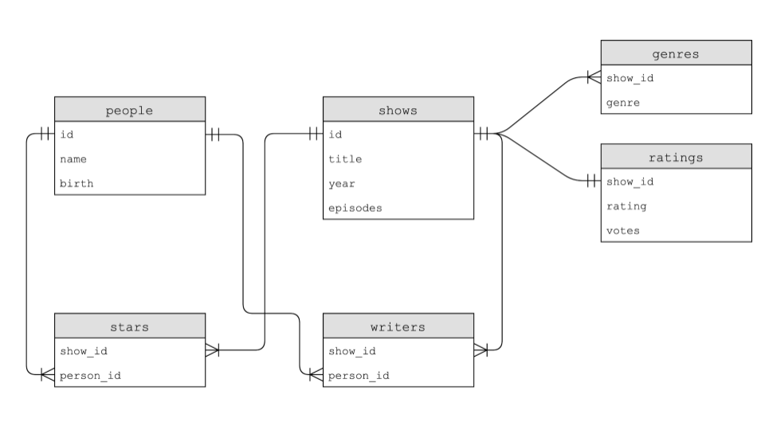

# Relational Databases
Relational databases store data in rows and columns in structures called tables.

# SQL: 
It is one such relational database. It allows for four types of commands (CRUD):
    1. Create - INSERT INTO
    2. Read - SELECT
    3. Update - UPDATE
    4. Delete - DELETE

# Set-up:
    # In cs50 'sqlite3 favorites.db' command can create a SQL database
    # We can put sqlite3 into csv mode by typing '.mode csv'. Then, we can import our data from our csv file by typing '.import favorites.csv favorites'
    # We can type .schema to see the structure of the database.

# Commands:
    # You can read items from a table using the syntax SELECT columns FROM table.
        # Here columns is the name of the column in the table
            # Example: SELECT language FROM favorites
        # SELECT * FROM table means we are selecting every column.
    # Commands to access data: 
        1. AVG - Average of the column
        2. COUNT - Provides count of total data that has been selected
        3. DISTINCT - Unique values of the column
        4. LOWER - Converts a string to lowercase
        5. UPPER - Converts a string to uppercase
        6. MAX - Highest value of the column
        7. MIN - Lowest value of the column
        8. WHERE - Adding a Boolean expression to filter our data
        9. LIKE - Filtering responses more loosely
        10. ORDER BY - Sorting responses (default is ASC)
        11. LIMIT - Limiting the number of responses
        12. GROUP BY - Grouping responses together
    # Examples:
        # SELECT COUNT(*) FROM favorites WHERE language = 'C'; => It gives the total number of keys (language is the key here) with value 'C'
        # SELECT COUNT(*) FROM favorites WHERE language = 'C' AND problem = 'Mario'; => Use of AND opearator just like we do in Python
        # SELECT language, COUNT(*) FROM favorites GROUP BY language; => This has two columns First will have language value (Python/C/Scratch) and next will have the count of those languages after grouping them together
        # SELECT language, COUNT(*) FROM favorites GROUP BY language ORDER BY COUNT(*) DESC; => ASC is default. Hence we need not mention ASC.
        # SELECT * FROM favorites ORDER BY language, problem; => This will sort by language. Then within langauges, the contents of problem will be sorted.
        # SELECT * FROM favorites ORDER BY language DESC, problem ASC; => This will sort by language in DESC and then within langauges, the contents of problem will be sorted in ASC.
        # SELECT language, COUNT(*) FROM favorites GROUP BY language ORDER BY COUNT(*) LIMIT 10; => Total results will be limited to 10.
        # SELECT language FROM favorites WHERE language LIKE "%C%" AND problem LIKE "%M" => This will filter the languages that has the letter 'C' in it and problems that starts with 'M'
            # % is called the wildcard operator.
        # INSERT INTO favorites (language, problem) VALUES ('SQL', 'Fiftyville'); => Adding data to a tabele. Syntax is INSERT INTO table (col1,col2,etc.) VALUES(val1,val2,etc.);
        # UPDATE favorites SET language = 'C++' WHERE language = 'C'; => Syntx is UPDATE tableName SET colName = 'oldValue' WHERE colName = 'newValue'
        # DELETE FROM favorites WHERE problem = 'Tideman'' => Syntax is DELETE FROM tableName WHERE colName = 'colvalue'
    # There is always a possibility where 2 tables can have same columnNames. In that case use a method operator like tableName.columnName

# Data-types in SQLite:
    1. BLOB - binary large objects that are groups of ones and zeros
    2. INTEGER - an integer
    3. NUMERIC - for numbers that are formatted specially like dates
    4. REAL - like a float
    5. TEXT - for strings and the like
    Additional - NOT NULL, UNIQUE
    Note: 
        # Primary Key: They are used to identify a unique record in a table. 
        # Foreign keys: They are used to build relationships between tables by pointing to the primary key in another table.

IMDB's database structure

# JOIN's:
    # This command combine tables temporarily (like it displays the result which can be used by us but doesn't alter the original table)
    # We can specify the column name for two tables which will be the reference point based on which JOIN will take place.
    # SQLite will find the common elements between the column and construct a new temporary table (by ignoring the uncommon elements)
    # Example: SELECT * "FROM shows JOIN ratings" ON "shows.id = ratings.show_id" WHERE title = 'The Office'; => Now we can see all the shows that have been called The Office.
        * Double quotes are for understanding purpose. They are not part of the command.

# Indexes:
    # They can be utilized to speed up our queries.
    # We can track the speed of our queries by executing .timer on in sqlite3.
    # Command: CREATE INDEX title_index on shows (title);
        # This will create a data structure called a B Tree, a data structure that looks similar to a binary tree. However, unlike a binary tree, there can be more than two child nodes. Hence the distance between parent and every child is reduced drastically.
    # Indexing all columns would result in utilizing more storage space. Therefore, there is a tradeoff for enhanced speed. Hence, we will be indexing the most frequently used columns.

# Race Conditions:
    # Utilization of SQL can sometimes result in some problems.
    # You can imagine a case where multiple users could be accessing the same database and executing commands at the same time.
    # This could result in glitches where code is interrupted by other people’s actions. This could result in a loss of data.
    # Built-in SQL features such as BEGIN TRANSACTION, COMMIT, and ROLLBACK help avoid some of these race condition problems.

# SQL Injection Attacks:
    # rows = db.execute("SELECT COUNT(*) FROM favorites WHERE problem LIKE ?", "%" + favorite + "%")
    # Here, unlike Python where a string format would have been used (f'...{}...'), we are using a question mark (?)
    # The issue is, -- is a way of writing comment in SQL. So whatever that is followed by -- will be ignored by SQL. SO, just imagine if a malicious user types the email as abc@gmail.com--, it will ignore everything to the right of it (including password column).    

# Design Principles:
